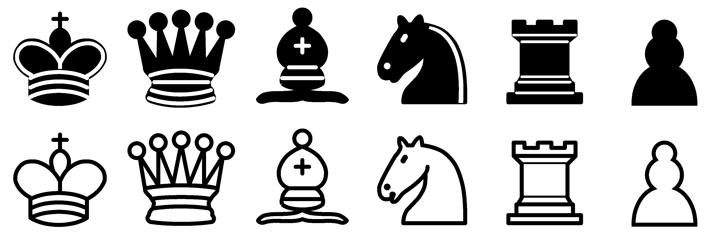

# StageXL Vector Chess Pieces

A package for StageXL that lets developers add high quality vector chess pieces to their project.



## Example
```dart
stage.addChild(BlackKing()
    ..x = 0
    ..y = 0
    ..width = size
    ..height = size);
```

## CREDITS

This project is using the SVG definitions of Chess pieces from a [Wikimedia Commons page](https://commons.wikimedia.org/wiki/Category:SVG_chess_pieces)

The SVG files were converted into AS3 drawing commands using Miller Medeiros (http://www.millermedeiros.com) SVG To Motifs Parser